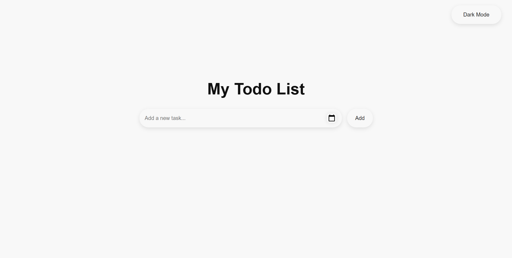
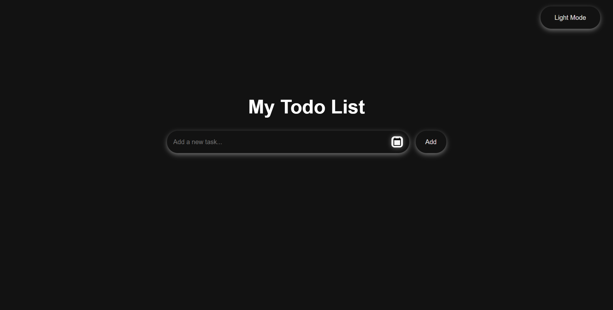
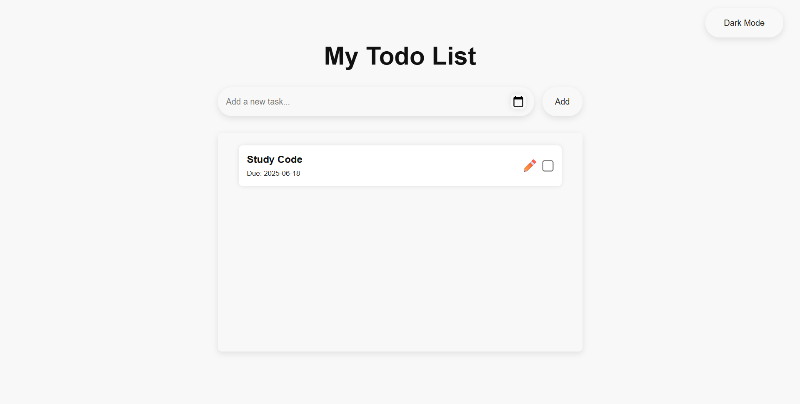
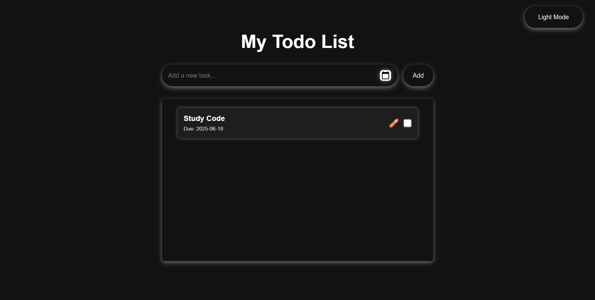

# My Todo List

A modern, responsive Todo List web application built with **HTML**, **CSS**, **JavaScript (ES Modules)**, **PHP**, and **MySQL**. Designed for learning and productivity, this project demonstrates full-stack development, modular code structure, and clean UI/UX principles.

---

## 📸 Screenshots






## 🚀 Features

- **User Authentication** (planned)
- **Add, Edit, Delete, and Mark Todos as Done**
- **Due Date Management**
- **Responsive UI with Animations and Transitions**
- **Dark Mode Toggle**
- **Feedback Popups for User Actions**
- **Modular Frontend and Backend Code**
- **RESTful API Endpoints**

---

## 📁 Folder Structure

```
myTodoList_PHP_MySql/
│
├── Public/           # Frontend assets (HTML, CSS, JS modules)
│   ├── index.html
│   ├── main.js
│   ├── modules/
│   └── style/
│
├── db/               # Database connection scripts
│   └── database.php
│
├── route/            # PHP API endpoints (CRUD)
│   ├── getTodo.php
│   ├── postTodo.php
│   ├── updateTodo.php
│   └── deleteTodos.php
│
├── utils/            # Utility scripts (e.g., JSON response)
│   └── jsonResponse.php
│
├── requirements/     # UI/UX requirements and mockups
│
└── readme.md
```

---

## 🛠️ Getting Started

1. **Clone the repository:**
   ```sh
   git clone https://github.com/Daibisan/myTodoList_PHP_MySql.git
   ```

2. **Setup the Database:**
   - Create a MySQL database named `mytodolistdb`.
   - Import your table schema (e.g., `todos` table) as needed.

3. **Configure XAMPP:**
   - Place the project folder in your `htdocs` directory.
   - Ensure MySQL is running on port `3307` (or update `db/database.php`).

4. **Run the App:**
   - Open [http://localhost/myTodoList_PHP_MySql/Public/index.html](http://localhost/myTodoList_PHP_MySql/Public/index.html) in your browser.

---

## 📚 What I Learned

1. **CI/CD Cycle Awareness**
    - Planning: Define features, design, and code structure before starting.
    - Coding: Implement features iteratively and test frequently.
2. **Web Development Flow**
    - UI/UX → HTML → CSS → JavaScript → Backend (PHP) → Database (MySQL)
3. **Leveraging AI**
    - Ask AI for help when stuck to speed up problem-solving.
4. **Code Readability**
    - Commenting code for better understanding and maintainability.
5. **UI Animation**
    - Adding transitions and animations for a better user experience.
6. **JS Modularization**
    - Organizing JavaScript code into modules for scalability.
7. **Async/Await**
    - Using `await` for cleaner asynchronous code.
8. **Functional Programming**
    - Applying FP paradigms for cleaner and more predictable code.

---

## 🧑‍💻 Author

- [Muhammad Rahsya Nadibia](https://github.com/Daibisan)

---

## 📄 License

This project is open source and available under the [MIT License](LICENSE).

---

## 🙏 Acknowledgements

- OpenAI for AI assistance
- Stack Overflow and the developer community

---

## 🤝 Contributing

Contributions are welcome! Please open issues or submit pull requests for improvements, bug fixes, or new features.

---


**Happy Coding! 🚀**
